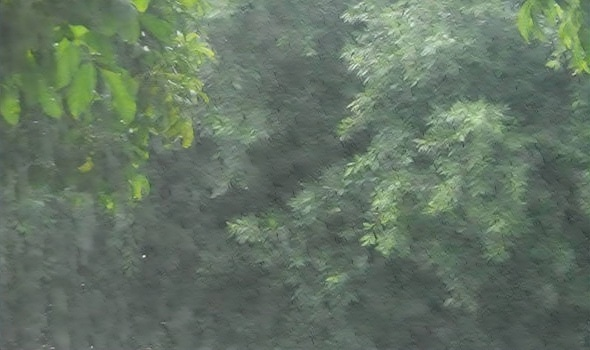

## [DUAL RECURSIVE NETWORK FOR FAST IMAGE DERAINING](https://csdwren.github.io/papers/DRN.pdf)

### Introduction
In this paper, we propose a dual recursive network (DRN) for fast image deraining as well as comparable or superior deraining performance compared with state-of-the-art approaches. Specifically, our DRN utilizes a residual network (ResNet) with only 2 residual blocks (ResBlock), which is recursively unfolded to remove rain streaks in multiple stages. Meanwhile, the 2 ResBlocks can be recursively computed in one stage, forming the dual recursive network. Experimental results show that DRN is very computationally efficient and can achieve favorable deraining results on both synthetic and real rainy images.
 
  
  
  

## Prerequisites
- Python 3.6, PyTorch >= 0.4.0 
- Requirements: opencv-python, tensorboardX
- Platforms: Ubuntu 16.04, cuda-8.0 & cuDNN v-5.1 (higher versions also work well)
- MATLAB for computing [evaluation metrics](statistics/)


## Datasets

DRN is evaluated on three datasets*: Rain100H [1], Rain100L [1] and Rain12 [2]. Please download the testing datasets from [BaiduYun](https://pan.baidu.com/s/1J0q6Mrno9aMCsaWZUtmbkg), and place the unzipped folders into `./test/`.

To train the models, please download training datasets: RainTrainH [1] and RainTrainL [1] from [BaiduYun](https://pan.baidu.com/s/1J0q6Mrno9aMCsaWZUtmbkg), and place the unzipped folders into `./train/`. 

*_We note that:
(i) The datasets in the website of [1] seem to be modified. But the models and results in recent papers are all based on the previous version, and thus we upload the original training and testing datasets to [BaiduYun](https://pan.baidu.com/s/1J0q6Mrno9aMCsaWZUtmbkg). 
(ii) For RainTrainH, we strictly exclude 546 rainy images that have the same background contents with testing images.
Our DRN is trained on remaining 1,254 training samples._


## Getting Started

### 1) Testing

We have placed our pre-trained models into `./logs/`.

test on Rain100H :
```bash
python test_Rain100H.py 
```

test on Rain100L :
```bash
python test_Rain100L.py 
```

test on Rain12 :
```bash
python test_Rain12.py 
```

We have placed four real rainy images into `./test/real`, you can test on real rainy images :
```bash
python test_real.py 
```

### 2) Training

Read the [configuration](#model-configuration) guide for more information on model configuration.

train the model for Rain100H:
```bash
python train_Rain100H.py
```
train the model for Rain100L:
```bash
python train_Rain100L.py
```


### 3) Evaluation metrics

We also provide the MATLAB scripts to compute the average PSNR and SSIM values reported in the paper.
 

```Matlab
 cd ./statistics
 run statistic_Rain100H.m
 run statistic_Rain100L.m
 run statistic_Rain12.m
```

### Model Configuration

The following tables provide the configurations of options. 

#### Training Mode Configurations

Option                 |Default        | Description
-----------------------|---------------|------------
batchSize              | 16            | Training batch size
intra_iter             | 7             | Number of intra iteration
inter_iter             | 7             | Number of inter iteration
epochs                 | 100           | Number of training epochs
milestone              | [30,50,80]    | When to decay learning rate 
lr                     | 1e-3          | Initial learning rate
save_freq              | 1             | save intermediate model
use_GPU                | True          | use GPU or not
gpu_id                 | 0             | GPU id

#### Testing Mode Configurations

Option                 |Default           | Description
-----------------------|------------------|------------
use_GPU                | True             | use GPU or not
gpu_id                 | 0                | GPU id
inter_iter             | 7                | Number of unfolding stages
intra_iter             | 7                | Number of recursive ResBlock

## References
[1] Yang W, Tan RT, Feng J, Liu J, Guo Z, Yan S. Deep joint rain detection and removal from a single image. In IEEE CVPR 2017.

[2] Li Y, Tan RT, Guo X, Lu J, Brown MS. Rain streak removal using layer priors. In IEEE CVPR 2016.

